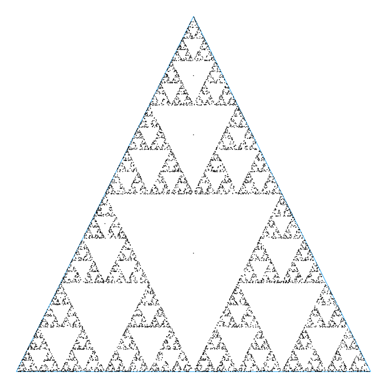

# Chaos Games

A simple bit of code to generate fractal patterns from a (regular) polygon. 

Includes restriction rules to change the games.

Includes basic plot recipe, to be expanded on.

## Installation
Git instructions

## Usage example
Inside cloned repository, activate environment. Then:

```julia
julia> include("src/ChaosGames.jl")

julia> using .ChaosGames

julia> x,y,pointsx,pointsy = ChaosGame(3,100000,0.5,...)

julia> p1 = CGscatter(x,y,pointsx,pointsy)
```

if you want to explore different options, or for simple sierpinski construction (or as a first try!) do: 

```
$ julia sierpinksi_run.jl
```



## To Do:
- clean up restriction code: naming, saving of unnecessary history of previous chosen vertices, ...
- option of generic (non-regular) polygon for the game
- simple plots and examples in repo examples folder and readme
- example code, simple explanation of basic algorithm in readme
- split code into several sections, including but not limited to:
  - generation of initial polygon, getting relevant info out
  - rules for chaos game (how to choose next vertex, next point to plot,...)
  - simple plotting (and animations?)
  - driving code (probably remain in src/ChaosGame.jl)
  - install/clone instructions for readme
- and more probably

## See also:
Wiki: https://en.wikipedia.org/wiki/Chaos_game
