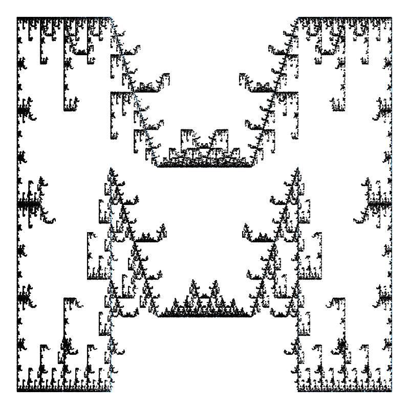
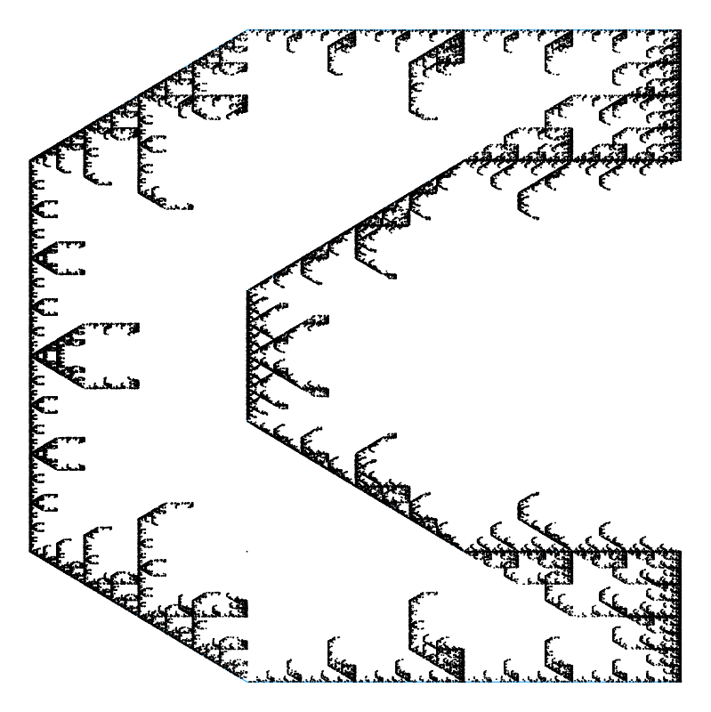
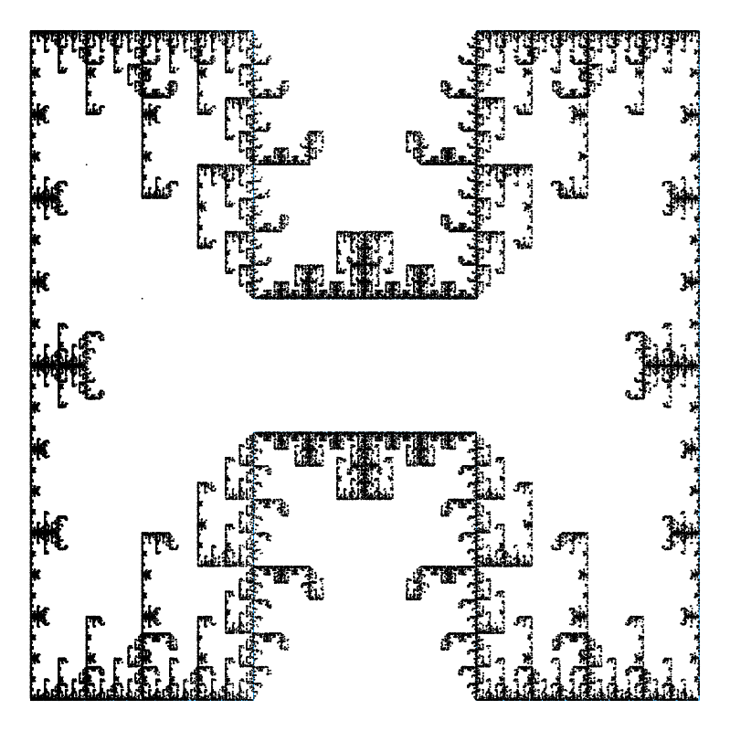
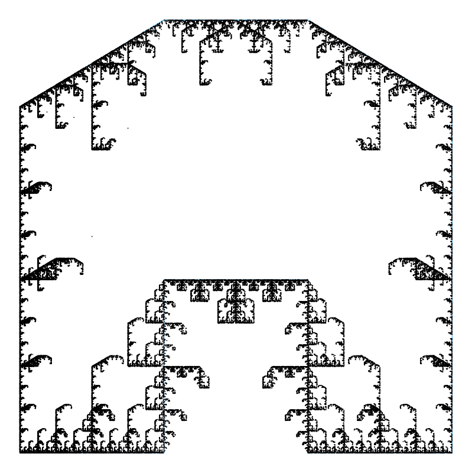
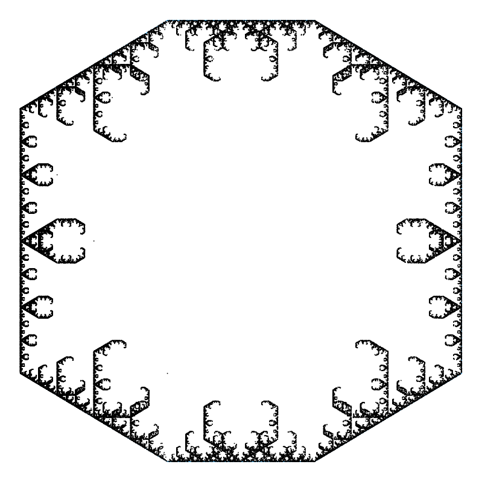
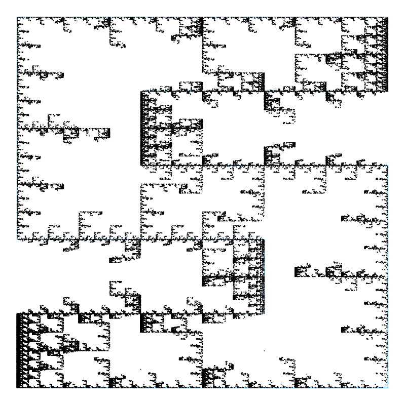
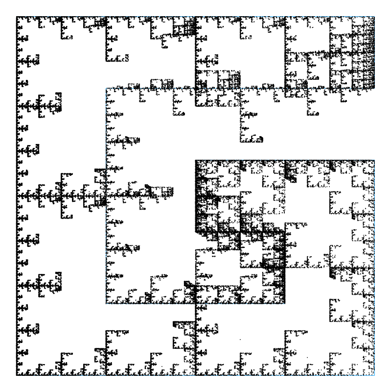
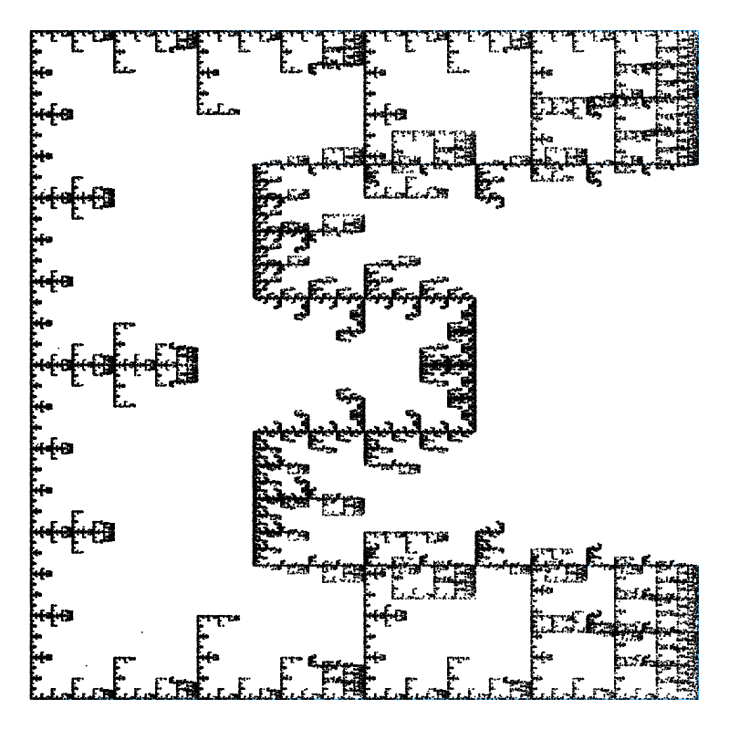

# Chaos Games

A simple bit of code to generate fractal patterns from polygons via a **chaos game**. Points in the fractal are generated iteratively, by choosing the next vertex of the polygon to move a set distance towards.

The polygon can either be a simple regular polygon defined by a number of sides (e.g. triangle), 


...or a user-defined vector of (x,y) coordinates with the correct ordering (e.g. letters).



C|H|A|O|S|G|A|M|E|S
:-:|:-:|:-:|:-:|:-:|:-:|:-:|:-:|:-:|:-:
|||||||||

We also implement restriction rules for the games: we can choose selection rules for the next vertex. For example, in the above letter examples, the next vertex to move towards must be either the same vertex as previously or its first neighbour. 

### TODO: more examples of restrictions

Includes basic plot recipe, to be expanded on.

## Installation
TODO: Git instructions

But seriously just clone the repo, instantiate environment and you're good

## Usage example
Inside cloned repository, activate the environment. 

```
Cloned_repository$ julia

julia> ]

(@v1.8) pkg> activate .
```
then Backspace to return to Julia REPL.

Then if you want to explore different options, do something like:

```julia
julia> include("src/ChaosGames.jl")

julia> using .ChaosGames

julia> x,y,pointsx,pointsy = ChaosGame(3,100000,0.5,...)

julia> p1 = CGscatter(x,y,pointsx,pointsy)
```

 Alternatively for simple sierpinski construction (or as a first try!), can run one of the example scripts: 

```
$ julia ./examples/sierpinksi.jl
```
which will recreate the first sierpinski example.

Other example scripts will eventually be contained in the examples folder.

## To Do:
- option for multiple shape chaos games?
- clean up restriction code: naming, saving of unnecessary history of previous chosen vertices, ...
- ~~option of generic (non-regular) polygon for the game~~
  - currently require some ordering of polygon (i do anticlockwise, following shape)? nicer way to do this?
- simple plots and examples in repo examples folder and readme
  - started
- example codes, simple explanation of basic algorithm in readme
  - started
- install/clone instructions for readme
- and more probably

## See also:
Wiki: https://en.wikipedia.org/wiki/Chaos_game
